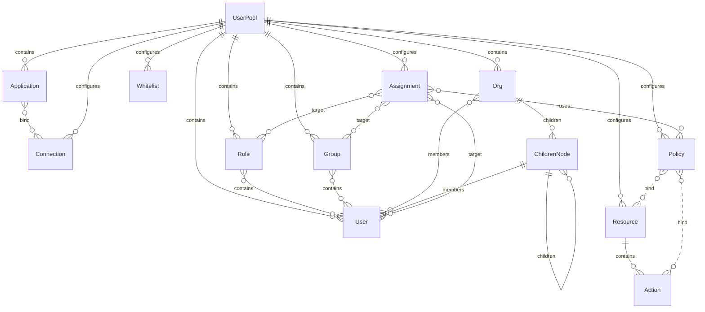

[Authing](https://authing.cn/) 是一个典型的 IDaaS。提供了多种[认证方式](https://docs.authing.cn/authentication/oidc/)和[社会化登录方式](https://docs.authing.cn/social-login/web/)。

## 实体

- 用户池：UserPool；
- 应用：Application；
- 连接身份源：Connection；
- 用户：User；
- 角色：Role；
- 分组：Group；
- 下级节点：ChildrenNodes；
- 组织：Org；
- 注册白名单：Whitelist；
- 资源：Resource；
- 策略：Policy；
- 授权：Assignment；

### 用户池

用户池是最高纬度的单位，每个用户池之间相互独立。

### 应用

对应 OIDC 中的概念就是 relying party。

### 连接身份源

Authing 的核心工作和 [[Dex]] 的一致，即作为中心节点连接多个 ID provider 和 relying party。而连接身份源就是这些 ID provider。

### 资源

资源是权限管理的对象。Authing 将其分为 3 这「资源类型」：数据、API、菜单。每个资源可以定义多个操作类型（actions）。

可以直观地看出：

- 菜单旨在控制显示哪些内容；
- API 旨在粗力度控制一个请求是否能被接收和处理；
- 数据旨在确定一个请求操作的对象是否能被操作。

但目前看来这个「资源类型」主要是一个语义上的概念，对策略管理的配置没有影响。

### 策略

一条策略是一个 resource 和多个 actions 的组合。

虽然资源是可以定义好的固定值，但是在策略配置时提供的依然是文本编辑（JSON）方式。即策略仅仅是规则，它与资源不是通过关系连接的。

### 授权

授权用来连接主体（用户、角色、组织其一）和策略。

## 关系图

