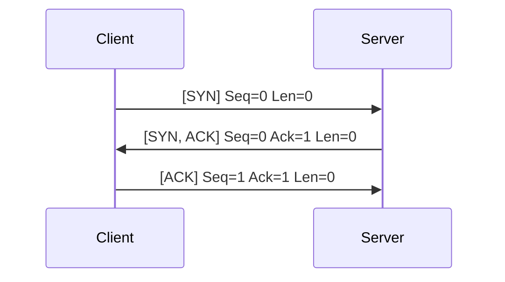
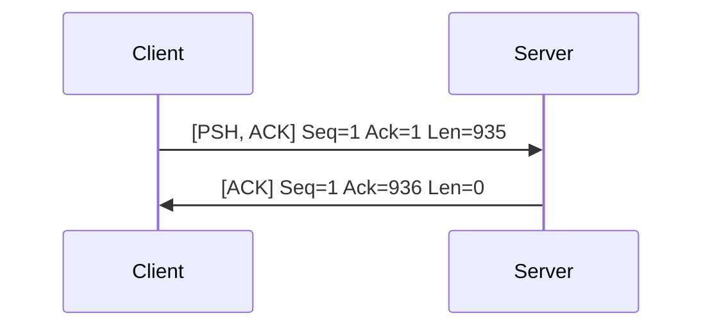
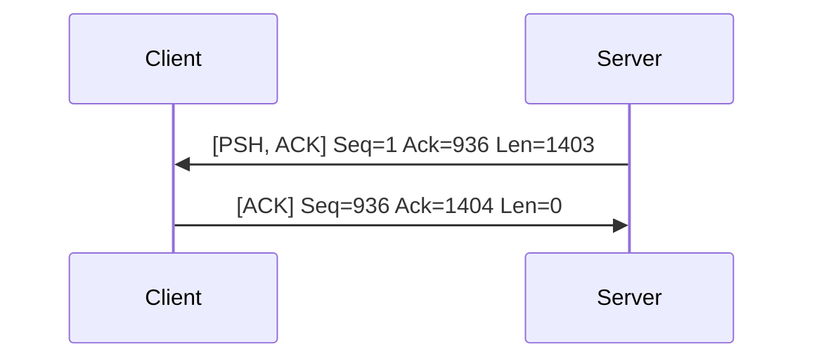
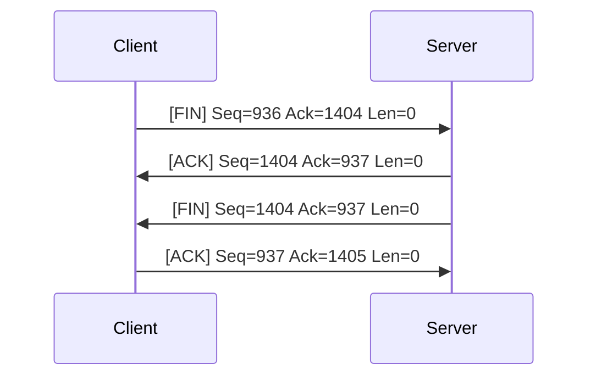

## 概述

我们知道 TCP 连接通过序号（sequence number）和确认号（acknowledgment number）来避免消息的乱序。发送端通过分组头部的 序号声明分组的第一个字节的序号，通过头部的确认号声明预期接收的下一个字节的序号。

图片来源：[Wikipedia](https://en.wikipedia.org/wiki/Transmission_Control_Protocol#cite_ref-RFC_793_9-0:~:text=TCP%20segment%20header)

让我们通过 Wireshark 抓取一个完整的 TCP 连接来看看具体是怎么实现的，着重关注 Seq 和 Ack 的变化。

## 概览

首先我们观察一个 TCP 请求的完整生命周期。可以看到：

1. 前三次传输的方向和标记位展示了 TCP 三次握手动作。
2. 从 No. 17466 开始的四次请求完成了 HTTP 相关的数据传输。
3. 从 No. 17940 开始的最后三次（除去黑色的那条）传输完成了挥手动作。

_由于样本中挥手阶段的特殊性，如果只希望了解正确的 TCP 请求中 Seq 和 Ack 变化，请参考上述步骤中的前两个阶段（握手和数据传输）。_

## 握手阶段

### 客户端 SYN

我们仔细查看客户端 SYN 分组，这是整个生命周期的第一个请求，可以看到 info 中显示 Seq=0。但是这个 Seq 是否真的是 0 呢？从下面的详情中可以看到，序号 0 是一个相对值，实际上客户端生成了一个随机数作为序号（2777949690）。标记位 SYN 说明了这个分组中的 Seq 是一个初始值，这对接收方来说很重要。

*所有序号都是基于一个初始的随机值，如果没有特殊说明，后续讨论中出现的序号均为相对序号。*

第一条 SYN 消息中的 ACK 标记位没有激活，所以消息头中的 Acknowledgment Number 是没有意义的，所以默认给了 0。

* 方向：客户端 -> 服务端
* Sequence Number: 0

### 服务端 SYN，ACK

服务端作为接收方收到客户端发送的 SYN 分组后，确认 SYN 标记位激活，Seq 相对序号为 0。开始准备返回的分组。

在分组中，服务端会激活 ACK 标记位，同时将接收到的分组序号加 1 作为 Ack 的值，即 Ack 置为 1，表示接收到了 Seq 为 0 的分组。

为了建立全双工通道，服务端也需要向客户端发送 SYN 信息，服务端激活 SYN 标记为，随机生成 Seq 值（相对序号为 0），组成分组发送给客户端。

* 方向：服务端 -> 客户端
* Sequence Number: 0
* Acknowledgment Number: 1

### 客户端 ACK

客户端接收到服务端的 SYN，ACK 分组，开始构成分组。

客户端为了表示确认收到服务端发来的分组，解析分组中的 Seq 相对序号为 0，在即将发送的分组中将 ACK 标记位激活，Ack 置为 1。

同时通过接收到的来自服务端的分组中 Ack 为 1，知道自己发送的 SYN 分组已经被确认接收，把即将发送的分组的 Seq 置为 1。

* 方向：客户端 -> 服务端
* Sequence Number: 1
* Acknowledgment Number: 1

经过以上步骤，TCP 三次握手就完成了。

## 数据传输

完成握手后，客户端准备发送 HTTP 请求。由[概览](#概览)中的截图可以看出，数据传输的四个分组可以分为两组，分别是：

1. 客户端发送的携带 HTTP 请求数据的 TCP 分组，和服务端接收到该分组返回的 ACK 分组。以及
2. 服务端发送的携带 HTTP 响应数据的 TCP 分组，和客户端接收到该分组返回的 ACK 分组。

*我们这里传输的数据都比较小，不考虑 TCP 拆分数据的情况。*

### 客户端发送 HTTP 请求

客户端将 HTTP 请求数据放在 TCP 分组中，指定 Seq=1，Ack=1 发送数据。这里需要留意的是，该分组大小为 935。

* 方向：客户端 -> 服务端
* Sequence Number: 1
* Acknowledgment Number: 1
* 荷载大小：935

### 服务端确认收到 HTTP 请求

服务端接收到搭载 HTTP 请求的 TCP 分组后，开始构建 ACK 分组。

服务端解析收到的分组发现这是一个 Seq=1 的长度为 935 的分组，即收到的最后一个字节的序号为 935。为了答复确认收到该分组，将即将发送的分组 ACK 标记为激活，Ack 置为 936。

接收到的分组中，Ack=1，所以即将发送的分组中将 Seq=1。

* 方向：服务端 -> 客户端
* Sequence Number: 1
* Acknowledgment Number: 936

### 服务端发送 HTTP 响应

服务端将 HTTP 响应数据放在 TCP 分组中，发送给客户端。这里需要注意的是，这个请求是基于上述 [客户端发送的请求](#客户端发送 HTTP 请求)，所以他的序号和确认序号设计的依据是和[前一个 ACK 分组](#服务端确认收到 HTTP 请求)是一致的。

* 方向：服务端 -> 客户端
* Sequence Number: 1
* Acknowledgment Number: 936
* 荷载大小：1403

### 客户端确认收到响应

客户端收到包含 HTTP 响应的 TCP 分组后，准备向服务端发送 ACK 确认分组。

由于接收到的分组 Seq=1，荷载大小为 1403，所以返回 ACK 标记为激活，Ack=1404。

由于接收到的分组中 Ack=936，所以 Seq=936。

经过以上四个步骤，HTTP 的请求和响应就都完成了。

* 方向：服务端 -> 客户端
* Sequence Number: 936
* Acknowledgment Number: 1404

## 挥手阶段

你可能会注意到，这里的挥手只经历了三步。这个问题我们会在之后的文章中讨论，现在先看看挥手时的序号变化。

### 客户端发送 FIN 分组

当客户端发送完所有消息后，就会发送 FIN 分组（这个分组里同时激活了 ACK 标记位，原因不明）。

该 FIN 分组基于[服务端发来的 HTTP 响应](#服务端发送 HTTP 响应)，所以 Seq 和 Ack 和[客户端发送的确认响应的 TCP](#客户端确认收到响应) 相同。

* 方向：服务端 -> 客户端
* Sequence Number: 936
* Acknowledgment Number: 1404

### 服务端同时发送 FIN，ACK 分组

理论上服务端应该先返回 ACK 分组，表示确认收到了客户端发送的 FIN 分组。但是也可以将 ACK 分组和声明服务器停止发送的 FIN 标记一起返回。所以 FIN 和 ACK 标记位同时被激活，分组被发送给客户端。

到了这里，我们应该已经有纠错的能力了，能够分析为什么 Wireshark 认为出现了乱序。因为这里的 FIN，ACK 分组应该返回的序号为：

* 方向：服务端 -> 客户端
* Sequence Number: 1404
* Acknowledgment Number: 937（不应该是 936）

### 客户端发送 FIN，ACK 分组

客户端的 TCP 服务接收到上述分组后，发现了异常，只能当作接收到了 FIN 请求，并重新发送了 FIN，ACK 分组。

* 方向：客户端 -> 服务端
* Sequence Number: 936
* Acknowledgment Number: 1405

### 服务端发送 ACK 分组

服务端收到了客户端发送到 FIN，ACK 分组，返回了 ACK 分组。

* 方向：服务端 -> 客户端
* Sequence Number: 1405
* Acknowledgment Number: 937

## 总结

我们按照理想情况（握手和数据传输阶段和样本一致，挥手阶段按照四次挥手）梳理一下整个请求流程。

### 握手阶段

### 数据传输

客户端发送请求

服务端发送响应

### 挥手阶段

可以这样理解：

1. ACK 分组是用来确认收到某个分组 B 的。假设分组 B 中 Seq=$n$ Ack=$m$。
   1. 如果分组 B 中 Len=0，那么 ACK 分组中 Seq=$m$ Ack=$n+1$
   2. 如果分组 B 中 Len 为 $i$，那么 ACK 分组中 Seq=$m$ Ack=$n+i$
2. 如果准备发送的分组是基于发送端已经发送的 ACK 分组，那么 Seq 和 Ack 和已经发送的 ACK 分组保持一致。

